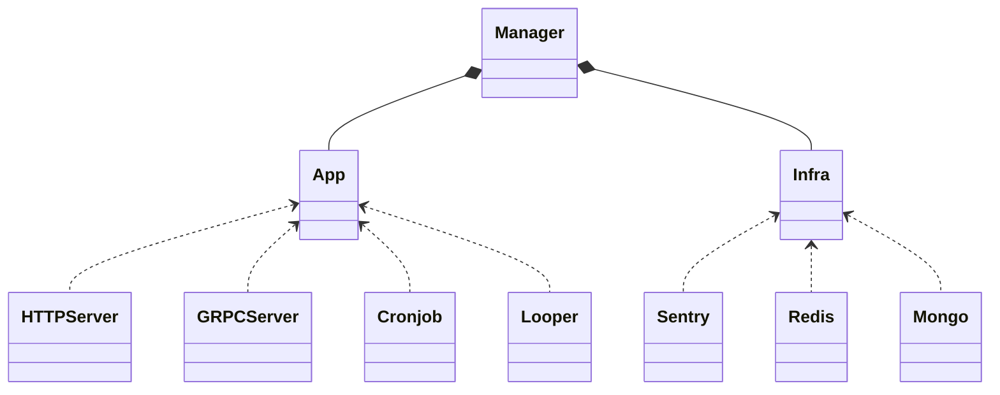

[![CI][ci-badge]][ci-url]

<br />
<div align="center">
  <h3 align="center">go-coco</h3>

  <p align="center">
    适配各种基础设施的微服务框架，搭配 <a href="https://github.com/google/wire">wire</a> 依赖注入模式可写出更简洁和安全的代码。
    <br />
    <a href="https://github.com/xieziyu/go-coco"><strong>Explore »</strong></a>
    <br />
  </p>
</div>

<details open>
  <summary>Table of Contents</summary>
  <ul>
    <li><a href="#getting-started">Getting Started</a></li>
    <li><a href="#modules">Modules</a>
      <ul>
        <li><a href="#installation">Installation</a></li>
        <li><a href="#app">App</a></li>
        <li><a href="#infra">Infra</a></li>
        <li><a href="#config">Config</a></li>
        <li><a href="#utils">Utils</a></li>
      </ul>
    </li>
    <li><a href="#cli">CLI</a>
      <ul>
        <li><a href="#cli-installation">CLI Installation</a></li>
        <li><a href="#dependencies">Dependencies</a></li>
        <li><a href="#commands">Commands</a></li>
      </ul>
    </li>
  </ul>
</details>

## Getting Started

1. 使用 `app.Manager` 组织需要启动的微服务应用
2. 使用 `config` 解析来自 toml 和 env 的应用变量配置
3. 使用 `infra` 快速构建基础层组件
4. 使用 `wire` 将应用和组件打包注入

## Modules

### Installation

```sh
go get github.com/xieziyu/go-coco@latest
```

### App

提供各类服务或者功能的应用组件，通过 `app.Manager` 整合，根据环境变量配置决定启动哪些应用，并自动处理优雅退出的问题，同时负责初始化和销毁所需要使用的基础设施组件。`Manager` 提供 `RegisterApp` 和 `RegisterInfra` 方法来注册 App 和 Infra 实例。


一个 App 实例需要实现如下接口，可以通过嵌入 `app.AlwaysEnabled` 来标识总是自动启用的 App (例如用于健康检查的 HTTPServer)
```go
type App interface {
	Start() error    // 应用的启动入口，包含初始化流程
	IsEnabled() bool // 应用启动的检测条件，例如 consumer 的环境变量开关是否开启等
}
```

一些辅助工具包：
* `app/server/xecho` 对 [echo/v4](https://github.com/labstack/echo) 的封装，帮助快速构建一个 HTTPServer
* `app/server/xgrpc` 对 [grpc](google.golang.org/grpc) 的封装，帮助快速构建一个 GRPCServer
* `app/looper` 用于快速构建一个循环任务应用(Looper)，目前提供 `SinglePod` 工作模式

<p align="right"><a href="#top">back to top</a></p>

### Infra

提供各类基础层组件，如第三方组件、数据仓储、消息中间件等。

包内提供了以下组件的实现：
* Redis: github.com/go-redis/redis
* Mongo: go.mongodb.org/mongo-driver
* Sentry: github.com/getsentry/sentry-go
* Kafka: github.com/segmentio/kafka-go

一个自定义的 Infra 实例需实现如下接口，可通过嵌入 `infra.Coco` 来实现
```go
package infra

type Infra interface {
	CocoInfra()
}
```

<p align="right"><a href="#top">back to top</a></p>

### Config

提供通用的 toml 和 env 解析工具，帮助快速构建一个系统配置实例

### Utils

提供常用的组件包

## CLI

go-coco 提供了便捷的 cli 工具用于快速生成一个基于 wire 的微服务项目。**特色是可按需**选择 Apps 和 Infras，生成的项目开箱即用。开发者只需修改一些项目特定的配置（如环境变量、配置等）
，然后便可将精力放在实现 service 本身的具体业务逻辑上了。

### CLI Installation

```sh
go install github.com/xieziyu/go-coco@latest
```

### Dependencies

首先你需要安装 [wire]。同时，由于 go-coco cli 提供了基于 protobuf + grpc-gateway 的实现方案生成，如果你希望在项目中使用 http + grpc 这样的解决方案，需要提前安装 [buf]

### Commands

#### 升级 CLI

```
go-coco upgrade
```

#### 查看版本号

```
go-coco version
```

#### 创建服务

```
Usage:
  go-coco init [service] [flags]

Flags:
      --alpine string   alpine version used in docker image (default "3.16")
  -h, --help            help for init
  -s, --skip-go-get     skip go get mods
```
该命令需要在包含 go.mod 的项目中执行，如果想全新的目录开始，请先执行 `go mod init`。命令执行后，会提示输入服务描述，并选择所需的 Apps 和 Infras。

- `[service]` 可以使用 `.` 此时服务名会设置成当前目录名;
- `[service]` 也可以加上 path 前缀，如 `app/post`

![demo][coco-example]


<!-- MARKDOWN LINKS & IMAGES -->
[ci-badge]: https://github.com/xieziyu/go-coco/actions/workflows/ci.yml/badge.svg
[ci-url]: https://github.com/xieziyu/go-coco/actions/workflows/ci.yml
[buf]: https://docs.buf.build/installation
[wire]: https://github.com/google/wire
[coco-example]: ./docs/coco.svg
